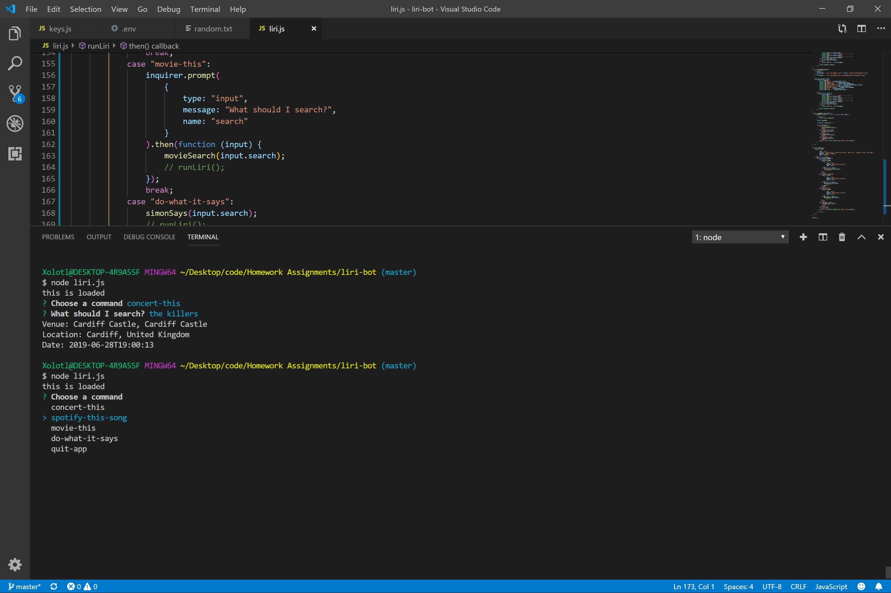

# liri-bot

**Liri bot is a Siri alternative isolated to the CLI.**

Liri allows you to search for concert, song, and movie information. It also has the capability to read previously loaded commands in a .txt file.

When searching for concert info, Liri will display the closest upcoming concert date for the desired artist, the venue that will host it, and the location of the venue.

If the user searches for song info, Liri will display the name of the song being researched, the artist who wrote it, its album, and a link that will redirect the user to the song's audio preview.

Finally, when searching for movie info, Liri will display general movie info such as: Movie name, release year, ratings, country of production, release language, plot, and actors.

## Instructions

Though it has not yet reached Siri's ability to take commands by voice input, Liri is still very straightforward and simple to use. Once in the CLI, all the user has to do to launch Liri is type 'node liri.js'. Liri will then launch and prompt the user with a list of the aforementioned available commands. The user can then use the 'up' and 'down' arrow keys to navigate through the commands and hit 'enter' to choose one. 

Once a command has been chosen, Liri will then prompt the user to type the desired query term. The user, once satisifed with their query term, will hit enter and wait for a response of the respective API. Once Liri receives a response, it will then display it in an easy to read format for the user to digest.

### Examples

What follows are examples of Liri running each command:

## App organization

The main functionality of the app is coded into the 'liri.js' file.

It is brokend down into functions. One function per command that will be run by the user and one to call Liri recursively (a feature that was not included in this versiona as unexpected behaviors occurred proably because of the asynchronous nature of API calls and their responses).

Beyond the functions used to run each command, the app includes a few more files. The 'keys.js' and '.env' files are employed to hide the API/Client keys from the user as well from any other developers that may eventually work on developing Liri.

The '.gitignore' file is created so that when pushing changes to GitHub, all the packages installed locally will not be uploaded and create a larger repository for other developers to download. Instead, a 'package.json' file is created with the purpose of storing the list of required packages for Liri to run and for future developers to use to automatically install said packages in their own environments.

## Technologies employed

*Spotify API: Song search
*OMDB API: Movie search
*Bands In Town API: Concert search
*FS package: To read files
*Inquirer package: Prompt the user for input in the CLI
*Axios: Make requests to the OMDB ans BandsInTown APIs

## Developers:
-Daniel Garcia(me): I was the lead and only developer in the creation of this app.
